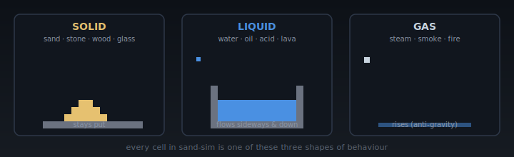
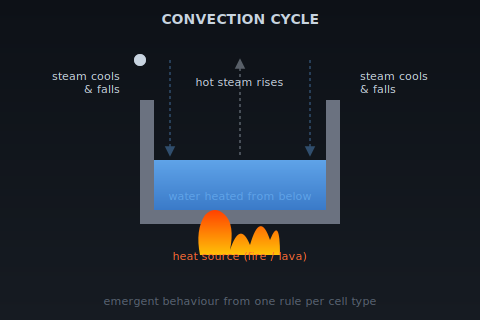
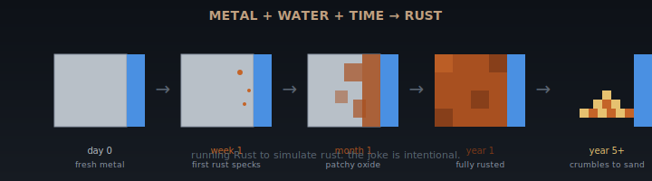

# Chemistry Primer

A 10-minute read covering the chemistry concepts the `sand-sim` simulation models. You don't need to memorise any of this — but skim it before Month 2 starts so the reaction names mean something to you.

The sim is a **rough cartoon** of real chemistry. Real combustion isn't "the cell next to fire has its temperature increased by 0.1 per frame" — but that rule produces something that looks and feels like fire, which is the point. Each section below ends with a short note on how the sim model differs from the real thing.

---

## 1. Matter and state

  

Everything in the sim is made of cells. Each cell has a **type** (sand, water, fire, …) and a **temperature**. That's it.

Real matter exists in **states** — solid, liquid, gas, plasma. The sim doesn't model plasma, but it does model:

| Sim type | Real-world state | Behaviour |
|---|---|---|
| Sand, stone, wood, glass | Solid (sand is technically granular) | Doesn't flow sideways. Sand falls under gravity; stone doesn't. |
| Water, oil, acid, lava | Liquid | Flows sideways as well as down. |
| Steam, smoke, fire | Gas | Rises under "anti-gravity". |

A material can switch state if its temperature changes enough — that's a **phase change** (see §3).

---

## 2. Combustion — fire

  

Combustion is **fuel + oxygen + heat → ash + heat + light**. It's a fast oxidation reaction (see §5). Three things must be present at once for combustion to happen:

1. **A fuel** (wood, oil, gunpowder, paper)
2. **Oxygen** (the air around us is ~21% oxygen)
3. **A heat source** above the fuel's **ignition temperature** (the threshold at which it catches fire on its own)

Remove any one of the three and the fire goes out. Pour water on fire? You're cooling it below ignition temperature. Smother fire? You're blocking oxygen. Burn through all the fuel? Same outcome.

**In the sim:**
- Each flammable cell type has its own ignition temperature (oil ignites at a lower temperature than wood — more easily set alight).
- Fire is itself a cell type with a short **lifetime** (it burns for ~60 frames then becomes empty).
- Fire raises the temperature of adjacent cells each frame — that's how it spreads.
- We **don't** model oxygen explicitly. Real fire in a sealed box would go out; sim fire in a sealed box keeps burning until its lifetime runs out. The sim is a cartoon.

> **Different fuels burn differently.** Wood is dense, slow-burning, hot. Oil is less dense, fast-burning, hotter. Gunpowder is extremely fast — that's an explosion: combustion happening so quickly that the expanding gases create a pressure wave. The sim approximates this by spawning many fire cells in a circular radius all at once.

---

## 3. Phase change — water → steam → water

  

Heating a liquid past its boiling point turns it into a gas. Cooling that gas turns it back. This is a **phase change** — same chemical, different state.

- Water boils at 100°C (at sea level). Below that it's a liquid; above, steam.
- The boiling itself **absorbs** energy (it's *endothermic*) — that's why a kettle takes a few minutes to boil. The water temperature climbs to 100°C and then *plateaus* there while the water turns into steam.
- Steam rising and cooling back to water is called **condensation**. The steam gives its heat back to the surroundings (it's *exothermic* now).

**In the sim:**
- Water with `temperature > 0.8` (a tuned threshold, not °C — the sim uses 0.0 = ambient, 1.0 = very hot) becomes steam.
- Steam rises (like reverse sand, faster) and has a short lifetime.
- When steam expires it becomes water again — that's our cartoon condensation.
- A heat source under a stone bowl of water gives a visible **convection cycle**: water boils, steam rises, steam cools at the top, falls as water, gets boiled again. This emergent behaviour is one of Month 2's wow moments.

---

## 4. Acids and dissolution

  

An **acid** is a substance that donates protons (hydrogen ions) in a reaction. The strong ones — hydrochloric acid, sulphuric acid — can break apart other materials at a molecular level. The acid usually gets consumed in the process.

Different materials resist acids to different degrees:
- **Metal** dissolves in acid quickly (think `metal + HCl → metal chloride + hydrogen gas`).
- **Stone** (limestone, marble — calcium carbonate) dissolves in acid, sometimes with visible fizzing as CO₂ is released.
- **Glass** is highly acid-resistant — that's why acids are sold in glass bottles.
- **Plastic and PTFE** are essentially immune to most acids.

**In the sim:**
- Acid is a liquid that dissolves sand, stone, and wood, each at a different probability per frame.
- Acid is consumed in the reaction (it becomes empty with some probability).
- Acid doesn't touch glass (added in Month 3).
- This is a cartoon — real acid–metal reactions release hydrogen gas, real acid–limestone reactions release CO₂. The sim ignores the by-products.

---

## 5. Oxidation — rust

  

Oxidation is the slow cousin of combustion. Same family of reactions — a material loses electrons to oxygen — but happening at room temperature over months or years instead of in a fraction of a second.

**Rust** is what iron does in the presence of water and oxygen: `4 Fe + 3 O₂ → 2 Fe₂O₃`. The orange-brown stuff is iron oxide. The metal underneath gets weaker as more of it is converted, and eventually flakes apart.

Aluminium also oxidises — but its oxide forms a thin protective layer that stops further oxidation. That's why aluminium foil doesn't crumble.

**In the sim (Session 22):**
- Metal cells next to water slowly accumulate a `rust_level` field.
- As it climbs, the cell colour shifts from silver to orange-brown.
- At maximum rust the cell crumbles to sand.
- And yes — you're running **Rust** to simulate **rust**. The joke is intentional.

---

## 6. State changes summary

Quick reference for the reactions modelled in the sim:

| Reaction | Real chemistry | Sim rule |
|---|---|---|
| Wood + fire → fire | Combustion | Wood next to a cell with `temperature > 0.6` ignites |
| Oil + fire → fire (fast) | Combustion (lower ignition temp than wood) | Oil ignites at lower threshold, spreads faster, hotter |
| Water + heat → steam | Endothermic phase change | Water with `temperature > 0.8` becomes steam |
| Steam (cooled) → water | Exothermic condensation | Steam past its lifetime reverts to water |
| Lava + water → stone + steam | Rapid cooling; phase change | Lava adjacent to water becomes stone; water becomes steam |
| Acid + stone → (gone) | Acid–carbonate dissolution | Stone next to acid becomes empty with some probability per frame |
| Metal + water (over time) → rust | Slow oxidation | Metal next to water accumulates `rust_level`; at max, crumbles to sand |
| Sand + extreme heat → glass | Vitrification (sand → silica glass at ~1700°C) | Sand with `temperature > 0.95` becomes glass |

---

## Further reading

If any of this sparked curiosity:

- **Combustion in detail:** Royal Society of Chemistry, "Fire triangle and tetrahedron" — explains why fire needs heat, fuel, oxygen, and a chain reaction.
- **Phase transitions:** any A-level physics textbook chapter on latent heat — the maths behind why boiling water plateaus at 100°C.
- **Rusting:** the Wikipedia article on "passivation" explains why aluminium doesn't rust even though it oxidises faster than iron.
- **Cellular automata:** Stephen Wolfram's *A New Kind of Science* (free online) — the deep theory of why simple rules produce complex behaviour. Optional, dense, fascinating.

---

Back to the [main README](./README.md) when you're ready.
