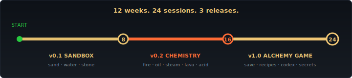

# 12 weeks. One window. Three games.

<p align="center">
  
</p>

> *"It's no good thinking about the danger now — the danger will think about you when it's ready."*
> — Terry Pratchett, *Lords and Ladies*

You're about to write something that runs in a black window.

By **Session 3**, sand will fall down it.
By **Session 11**, fire will spread across wood.
By **Session 16**, you'll be lighting oil on fire and watching the water above it boil into steam.
By **Session 24**, it's a game — recipes to discover, secrets to find, a codex to fill in.

**Same program. Twelve weeks. Three releases.** One growing thing.

No music theory. No abstract maths. Just **code, run, see**.

---

## The three releases

<p align="center">
  
</p>

### Month 1 — **Sandbox** (v0.1)

Click. Sand. Water. Stone. Pyramids. Reservoirs. Waterfalls.

The first time the sand starts piling up by itself, you'll text someone.

<p align="center">
  
</p>

### Month 2 — **Chemistry** (v0.2)

Five new elements. Fire spreads. Oil ignites — explosively. Lava cools. Water boils. Acid eats.

Suddenly your sandbox is a place where things happen *to* each other.

<p align="center">
  
</p>

### Month 3 — **Alchemy** (v1.0)

You wrap the chemistry in a **game**. New players start with four locked tiles. To unlock the rest they have to discover the recipes — sand + fire = glass, lava + water = stone, fire + oil = (you can guess). Three of the recipes you hide on purpose, just to mess with them.

<p align="center">
  
</p>

---

## Wow moments

Every session has one. The whole course is engineered around them — a named, deliberate "oh I just did that" beat in every lesson. Some highlights:

| Session | Wow moment |
|:---:|---|
| **1** | Your first window opens. Click draws coloured pixels. |
| **3** | **Sand piles itself.** Just from the rules you wrote. |
| **7** | Brush radius — paint at any size with the scroll wheel. |
| **8** | v0.1 ships with a UI, FPS counter, and a sand-pour whoosh. |
| **11** | **Fire spreads** across wood and burns out. |
| **13** | **Water boils to steam.** Steam rises. Then condenses back. |
| **16** | v0.2 ships. **EXPLOSIONS.** |
| **18** | **Save and load.** Close the app. Open it. Your world's still there. |
| **20** | The codex opens. Discovered tiles in colour, undiscovered as ???. |
| **23** | A codex tile **flips from ??? to discovered** mid-game. Real game energy. |
| **24** | v1.0 ships with a title screen. You shipped a game. |

---

## What you'll actually do this week

Each session is sized for **about an hour** of focused work, twice a week, for twelve weeks. That's it. No homework.

- **First runnable thing on screen:** within the first 20 minutes of every single session. (If it isn't, the troubleshooting note tells you what to check.)
- **A `starter/` and a `solution/`** ships with every session. If your code breaks, you can roll back in one command — copy `starter/` over your work-in-progress and you're back on a known-good footing.
- **A printable session log** to fill in by hand at the end (5–10 minutes), so the DofE evidence pack writes itself.
- **An optional challenge** at the end. No solution provided. That one's for you.

→ Start at [**SETUP.md**](./SETUP.md) (~30 min, one-off), then [**month-1/session-00/**](./month-1/session-00/) (~45 min, also one-off), then [**month-1/session-01/**](./month-1/session-01/) and you're off.

---

## What's under the hood

Just two libraries to start with. Two more in Month 3. That's all.

- **`macroquad`** — the window, the drawing, the mouse, the keyboard, the audio. The whole game framework, in one crate. Added in Session 1.
- **`fastrand`** — fast random numbers for fire and reaction probabilities. Added in Session 3.
- **`serde` + `serde_json`** — save the world to a human-readable JSON file. Added in Session 18.

Everything is one `cargo run --release` away. Windows, macOS, Linux — same code, same window.

---

## Take screenshots as you go

Visible progress is a real thing. There's a [**screenshot checklist**](./screenshots/README.md) with about **16 specific moments** worth capturing as you build — your first window, the first sand pile, the first fire, the codex unlocking, the v1.0 title screen.

Drop the PNGs in [`screenshots/`](./screenshots/) and commit them. By Session 24 you'll have a visual diary of the whole build. **The assessor flips through your binder seeing the project come to life. You scroll the folder and see how far you've come.**

---

## Show your work — pick a path (or both)

DofE asks you to keep a record. Two ways to do it. You can mix freely.

| Path | What it is | Best for |
|---|---|---|
| **A — Paper** | Print the booklet from [`dfe/session-log-printable.md`](./dfe/session-log-printable.md). Fill in one page per session with a biro. | If you like writing by hand, or if your assessor prefers a binder. |
| **B — Git** | Edit [`dfe/session-log.md`](./dfe/session-log.md) and `git commit`. Same content, different surface. | If you want every entry to be timestamped automatically and visible on GitHub. |

Most participants do both. The choice doesn't change the course one bit.

The full DfE evidence pack — paths, log templates, milestone reflections, the assessor briefing — lives under [**dfe/**](./dfe/README.md).

---

## Repo layout (the short version)

```
README.md              you are here
SETUP.md               install Rust + macroquad deps · Win / macOS / Linux
CHEMISTRY-PRIMER.md    combustion, phase change, oxidation · 10-min read
GLOSSARY.md            every bit of jargon, in plain English

diagrams/              the SVGs you're seeing in this README
screenshots/           drop your build screenshots here as you go

dfe/                   Duke of Edinburgh Award evidence pack
month-1/               Sessions 1–8 + sand-sim v0.1
month-2/               Sessions 9–16 + sand-sim v0.2
month-3/               Sessions 17–24 + sand-sim v1.0
resources/             cheatsheet · compiler-error reference
```

Each session folder has the lesson `README.md`, a `starter/` Cargo project (where the code is at the start), and a `solution/` (where it ends). The milestone releases live in `month-X/milestone/sand-sim-vX.Y/`.

---

## House rules

1. **You see something on screen in the first 20 minutes of every session.** If you don't, the troubleshooting note tells you what to check.
2. **No pseudocode.** Every code snippet in this course compiles. Every example folder is a real Cargo project you can `cargo run`.
3. **You can roll back in one command.** If your code breaks, copy the next session's `starter/` over your work and pick up where the lesson is.
4. **Every session has a named Wow Moment.** That's the moment something visible changes and you go "oh I just did that". If a session went past without one, the lesson is broken — open an issue and flag it.
5. **No talking down.** Real terminology, explained clearly. The compiler doesn't dumb things down for you, and neither will we.

---

## Stuck? You're not stuck.

Every session ships a working `solution/`. If your build is broken and you don't know why:

```bash
# copy the working answer over your code
cp -r month-1/session-03/solution/src/* month-1/session-03/starter/src/
```

You're back on a known-good footing. **This is a feature, not cheating.** Real developers reset to a known-good state all the time — that's literally what `git reset --hard` is for.

The [**GLOSSARY**](./GLOSSARY.md) explains every piece of jargon (`compiled`, `immutable`, `borrow`, `trait`, `cellular automaton`, `emergent behaviour`, `phase transition`, …) in plain English.

The [**CHEMISTRY PRIMER**](./CHEMISTRY-PRIMER.md) covers combustion, phase change, and oxidation in ten minutes. Optional but it makes the reaction names land harder if you skim it before Month 2.

The [**compiler-error reference**](./resources/compiler-errors.md) translates the most common Rust errors into plain English with fixes. Linked from every session's "Stuck?" footer.

---

## Licence

MIT. Fork it, remix it, run a workshop with it, teach it to your little brother. If you build something cool on top, [open a PR](https://docs.github.com/en/pull-requests/collaborating-with-pull-requests/proposing-changes-to-your-work-with-pull-requests/about-pull-requests) — we'd love to see.

See [`LICENSE`](./LICENSE) for the full text.

---

## Acknowledgements

Built around the Rust language and its community. Thank you to the maintainers of `cargo`, `rust-analyzer`, `macroquad`, `fastrand`, `serde`, and `serde_json` — every crate used in this course. And to Noita, Powder Toy, Falling Sand Game, and Sandspiel, for proving that pixels falling down a screen never stops being interesting.

---

→ Next: [**SETUP.md**](./SETUP.md)
