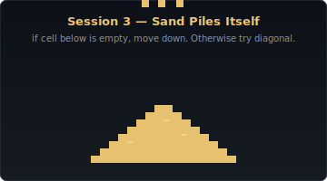

# Month 1 — The Engine

**Sessions 1–8 · Release: `sand-sim` v0.1**

<p align="center">
  
</p>

The first month is about getting Rust on screen. By the end of these eight sessions you'll have a real-time falling-sand sandbox running in a window: click to draw sand, water, or stone, watch them obey physics, build piles and dams and waterfalls. 60 frames per second. Nothing fancy yet — no fire, no chemistry — but a real, satisfying toy.

The eight sessions trade off **new Rust concept** with **new visible feature** so the dopamine never runs out. By Session 3 sand falls and piles. By Session 5 there are multiple elements. By Session 8 there's a UI.

---

## The arc

| Session | Concept introduced | What it adds to the sim |
|---|---|---|
| 1 | `cargo`, `loop`, `Vec<Vec<u8>>`, mouse input | A window. Clicking draws coloured dots on a grid. |
| 2 | `let`/`let mut`, scalar types, `const`, `if`/`else` | Multiple element types stored properly. |
| 3 | Nested `for` loops, swap-in-Vec, `fastrand` | **Sand falls and piles up.** |
| 4 | `if`/`else if`/`else`, bounds checking, refactoring | Cleaner update loop, no edge-crashes. |
| 5 | `match`, exhaustive matching | Sand, water, stone — each with different physics rules. |
| 6 | `enum` with `#[derive(...)]` | The grid stops using magic numbers; the compiler catches missing cases. |
| 7 | (Project session — no new concept) | Element selector UI, keyboard shortcuts, brush radius via scroll wheel. |
| 8 | (Project session — no new concept) | FPS counter, pause, clear, erase, on-screen legend, sound effect. **v0.1 ships.** |

---

## What you'll know by Session 8

- How to set up a Rust project with `cargo new` and add a crate with `cargo add`
- The difference between `let` and `let mut`, and why immutability is the default
- Scalar types: `u8`, `usize`, `f32` — and why Rust insists you pick the right one
- Flow control: `if`/`else`, `loop`, `while`, `for`
- Pattern matching with `match` and why it's nicer than a chain of `if`s
- Defining your own enums and structs
- Working with `Vec` and `Vec<Vec<T>>`
- The `macroquad` basics: opening a window, drawing rectangles, reading the mouse, playing a sound

---

## What you'll build

`sand-sim` v0.1 — a real-time falling-sand sandbox with:

- A 600×400-pixel window running at 60fps
- Three elements: **sand** (falls, piles, spreads diagonally), **water** (flows sideways), **stone** (static walls)
- Click-and-drag to paint cells in the selected element
- Right-click to erase
- Element selector in the corner (also: keys `1`, `2`, `3`)
- Variable brush size with the scroll wheel
- Pause (spacebar), clear (`C`), FPS counter
- A soft sand-pour sound while you're spawning sand

The whole thing is one Cargo project: `month-1/milestone/sand-sim-v0.1/`. Sessions 7 and 8 build it directly in that folder; the earlier sessions live in per-session `starter/` and `solution/` folders so you can roll back if something goes wrong.

---

## The Month 1 milestone

After Session 8, complete [`dfe/milestone-1-reflection.md`](../dfe/milestone-1-reflection.md). Commit the finished `sand-sim-v0.1/` and tag the commit `v0.1` if you like — that's a nice DofE evidence beat to point at.

---

## Crate budget for Month 1

Only two external crates:

- **`macroquad`** (~0.4.x) — windowing, drawing, input, audio. Added in Session 1.
- **`fastrand`** (~2.x) — fast pseudo-random numbers for diagonal sand spread. Added in Session 3.

Both are stable, small, and have no surprising transitive dependencies.

---

## Linux note

macroquad needs the X11 + OpenGL development headers. If you skipped this in `SETUP.md`, do it now:

```bash
sudo apt install -y libx11-dev libxi-dev libgl1-mesa-dev libasound2-dev pkg-config
```

(Arch: `sudo pacman -S libx11 libxi mesa alsa-lib pkgconf`. Fedora: see [`SETUP.md`](../SETUP.md).)

The `libasound2-dev` is for the sound effect in Session 8 — you can skip it until then if you'd rather not install ALSA headers yet.

---

## Ready?

→ [Session 1: A Window, a Grid, and Your First Pixel](./session-01/README.md)
