# Session 1 — A Window, a Grid, and Your First Pixel

<p align="center">
  
</p>

> **Stuck on a word?** Things like *immutable*, *compiler*, *crate*, *async* are all defined in plain English in the repo's [GLOSSARY.md](../../GLOSSARY.md).

---

## The Goal

By the end of this session you will have a **black window open on your screen** where **clicking draws coloured pixels** on a grid that Rust is rendering 60 times every second.

That's it. That's the whole goal. No theory you don't need. We get to the visible thing first.

---

## What you'll learn

- How to start a new Rust project with `cargo new`
- How to add a library to your project with `cargo add`
- What a Rust `fn main` looks like
- What `macroquad` is and the absolute smallest program you can write with it
- How to store a grid of cells in a `Vec<Vec<u8>>`
- How to read the mouse and draw rectangles every frame

---

## The big idea

You're about to write a **real-time simulation**. That means the program runs a `loop` and does the same set of things — read input, update the world, draw the world — **sixty times every second**, forever, until you close the window. Films are usually 24 frames per second. Video games are 60 or 120. Yours will be 60.

Inside that loop, everything you see on screen is just **rectangles**. Lots of them. The "grid" we'll set up today is a 2D table of numbers — one number per pixel-sized cell — and on every frame we ask: what colour should each cell be? Then we draw them.

That same idea — "a grid of numbers we draw 60 times per second" — is the entire engine for the next 24 sessions. Fire, water, oil, lava, the codex, the save file, the gunpowder explosions, all of it. Everything sits on top of this.

So today is short. Setup. One library. One loop. Click. Pixel. Done.

---

## Building towards `sand-sim`

This session creates the project folder, opens the window, and gets clicks turning into coloured cells. By Session 3 those cells will fall. By Session 5 you'll have three different elements. By Session 8 you'll have shipped v0.1.

Everything starts here.

---

## Step-by-step walkthrough

> **Where you should be.** You've already worked through [SETUP.md](../../SETUP.md) and [session-00](../session-00/README.md). `rustc --version` and `cargo --version` both work in your terminal. VS Code is installed with the `rust-analyzer` extension. If any of that isn't true, fix it first.

### 1. Make a new project — 2 minutes

Open a terminal **anywhere outside this repo** (your `~/Projects` folder or `Documents` is fine — Cargo can't make a new project inside another Cargo project). Then:

```bash
cargo new sand-sim
cd sand-sim
```

What just happened: Cargo created a folder called `sand-sim/` with:

- a `Cargo.toml` file — the project's index card. Name, version, list of libraries.
- a `src/main.rs` file — the actual code. Currently a one-line "Hello, world!".

Open the folder in VS Code:

```bash
code .
```

Open `src/main.rs`. You'll see:

```rust
fn main() {
    println!("Hello, world!");
}
```

`fn` is `function`. `main` is the special function that every Rust program starts with. `println!` writes a line to the terminal (the `!` means it's a **macro**, not a regular function — we'll explain macros properly later). Run it:

```bash
cargo run
```

The first run takes a few seconds because Cargo is compiling. You should see `Hello, world!` printed in the terminal. Congratulations: that's a working Rust program.

### 2. Add `macroquad` — 1 minute

`macroquad` is a small library that gives you a window, a canvas, a mouse, a keyboard, and audio. One command:

```bash
cargo add macroquad
```

Open `Cargo.toml` again. There's a new line under `[dependencies]`:

```toml
[dependencies]
macroquad = "0.4"
```

That's it. Cargo will download macroquad next time you run `cargo run`.

> **What's a crate?** "Crate" is Rust's word for a package — a library someone else wrote that you can pull into your project. `macroquad` is a crate. `fastrand` (later) is a crate. The repository of all public crates is [crates.io](https://crates.io). You don't need to make an account or anything; `cargo add` just works.

### 3. The smallest possible macroquad program — 3 minutes

Replace **everything** in `src/main.rs` with this:

```rust
use macroquad::prelude::*;

#[macroquad::main("Sand Sim")]
async fn main() {
    loop {
        clear_background(BLACK);
        next_frame().await;
    }
}
```

Save the file. From the terminal in the `sand-sim/` folder:

```bash
cargo run
```

This compile will take **noticeably longer** the first time — macroquad pulls in a handful of dependencies and they all have to build. Two minutes is normal. Subsequent runs are instant.

When it finishes, **a black window opens**. It's empty. Move it around. Resize it. Close it (clicking the close button or `Cmd-Q` / `Ctrl-Q` returns control to the terminal).

**You just opened a window in Rust.** First runnable checkpoint hit, well inside the first 20 minutes.

#### What is this code doing?

Line by line:

- `use macroquad::prelude::*;` — bring all the names macroquad commonly exports (like `BLACK`, `clear_background`, `next_frame`, `draw_rectangle`, …) into scope so we don't have to write `macroquad::prelude::BLACK` every time.
- `#[macroquad::main("Sand Sim")]` — a macro that wraps your `main` function in macroquad's setup code (opens a window titled "Sand Sim", sets up OpenGL, starts the event loop). You only ever write this once per program.
- `async fn main()` — `async` is needed because macroquad hands control back to the operating system between frames. You'll use the keyword and that's it. **Don't worry about it for now.**
- `loop { ... }` — runs forever. This is the heart of every real-time program: do the same thing over and over.
- `clear_background(BLACK);` — paint the whole window black at the start of each frame, so old drawings don't leave streaks.
- `next_frame().await;` — wait for the next frame to be ready (~16 ms later, which gives you ~60 frames per second). Then the `loop` runs again.

If you remove the `loop`, the window opens and immediately closes. If you remove `next_frame().await`, the program pegs your CPU at 100% as it tries to render as fast as possible. Both are useful experiments — try them and see.

### 4. Add a grid — 5 minutes

Right now nothing happens between `clear_background` and `next_frame`. Let's put a grid of cells in there. Replace `main`:

```rust
use macroquad::prelude::*;

const COLS: usize = 120;
const ROWS: usize = 80;
const CELL_SIZE: f32 = 6.0;

fn window_conf() -> Conf {
    Conf {
        window_title: "Sand Sim".to_owned(),
        window_width: (COLS as f32 * CELL_SIZE) as i32,
        window_height: (ROWS as f32 * CELL_SIZE) as i32,
        ..Default::default()
    }
}

#[macroquad::main(window_conf)]
async fn main() {
    // The grid: ROWS rows, each containing COLS columns of u8.
    // 0 means "empty", 1 means "sand" (for now).
    let mut grid: Vec<Vec<u8>> = vec![vec![0u8; COLS]; ROWS];

    loop {
        clear_background(BLACK);

        // Draw every non-empty cell as a sand-coloured rectangle.
        for row in 0..ROWS {
            for col in 0..COLS {
                if grid[row][col] != 0 {
                    let x = col as f32 * CELL_SIZE;
                    let y = row as f32 * CELL_SIZE;
                    draw_rectangle(x, y, CELL_SIZE, CELL_SIZE, YELLOW);
                }
            }
        }

        next_frame().await;
    }
}
```

Run it. Same black window, slightly larger. **You don't see anything new yet** — every cell in the grid is `0`, so the drawing loop skips them all. That's expected. We'll feed it some `1`s in step 5.

#### What's in this code?

- **`const COLS: usize = 120;`** — a constant. Constants never change at runtime. `usize` is the integer type Rust uses for "an index into something" — array positions, vector lengths, that sort of thing. You'll see it a lot.
- **`window_conf` + `#[macroquad::main(window_conf)]`** — we want a window of a specific size (120 × 80 cells, each 6 pixels wide). The `Conf` struct is macroquad's way of letting you customise the window.
- **`Vec<Vec<u8>>`** — a vector of vectors of `u8`. A `Vec` is a growable list. A `u8` is an unsigned 8-bit integer (values 0–255). So this is "a list of rows, where each row is a list of bytes." A 2D grid.
- **`vec![vec![0u8; COLS]; ROWS]`** — the `vec!` macro builds a `Vec`. `vec![0u8; COLS]` makes one row of `COLS` zeros. `vec![<that>; ROWS]` makes `ROWS` copies of it. Net effect: a 80 × 120 grid of zeros.
- **`let mut grid`** — `let` declares a variable. `mut` means we'll change it (Rust variables are immutable by default — more on this in Session 2).
- **`for row in 0..ROWS`** — a `for` loop that runs `row = 0, 1, 2, …, ROWS-1`. Nested with the inner `col` loop, we visit every cell in the grid once per frame.
- **`draw_rectangle(x, y, w, h, colour)`** — macroquad draws a filled rectangle at `(x, y)` with width `w` and height `h`. `x` and `y` are pixel coordinates with `(0, 0)` at the **top-left** of the window. (Game and graphics libraries almost always put `y = 0` at the top — this is normal.)

### 5. React to mouse clicks — 5 minutes

Inside the `loop`, **before** the drawing block, add:

```rust
        if is_mouse_button_down(MouseButton::Left) {
            let (mx, my) = mouse_position();
            let col = (mx / CELL_SIZE) as usize;
            let row = (my / CELL_SIZE) as usize;
            if row < ROWS && col < COLS {
                grid[row][col] = 1;
            }
        }
```

Save. Run. **Click and drag inside the window.** Yellow pixels appear under your cursor.

> **The Wow Moment.** Click on the window. You're drawing on a grid that Rust is rendering 60 times a second. Nothing falls yet, nothing reacts — but every cell that holds a `1` becomes a yellow rectangle on the next frame. *You just built the first 90 seconds of a falling-sand game.* Send a screenshot to someone.
>
> *(Drop the PNG into [`screenshots/`](../../screenshots/) as `01-first-pixel.png` — that's the first entry in the [screenshot checklist](../../screenshots/README.md).)*

#### What's in the mouse code?

- **`is_mouse_button_down(MouseButton::Left)`** — returns `true` every frame the left button is held down. (`is_mouse_button_pressed` would only return `true` on the frame the click *starts* — try swapping it and notice the difference: you can only place one pixel per click.)
- **`mouse_position()`** returns the cursor's pixel position as `(f32, f32)` — `(mx, my)`.
- **`(mx / CELL_SIZE) as usize`** — divide by the cell width to get the column index. The `as usize` is a **cast** — Rust never auto-converts between number types, so we tell it explicitly.
- **`if row < ROWS && col < COLS`** — the **bounds check**. If you happen to click slightly outside the window (which can happen for a frame as the cursor leaves), the calculated `row`/`col` could be out of range. Indexing a `Vec` with an out-of-range value crashes your program. The `if` prevents that. **You will write code like this constantly.** Rust forces you to think about edges; it's part of why Rust code is so reliable.

---

## Common mistakes

### Window opens then immediately closes

You probably removed the `loop { ... }`. Without a loop, `main` runs once, returns, and the program exits.

### Yellow pixels appear in the wrong place

Either the math in `col`/`row` is wrong, or you mixed up `(x, y)` with `(col, row)` somewhere. Remember: **`x` is the horizontal pixel and corresponds to the column; `y` is the vertical pixel and corresponds to the row.** Rows go down; columns go across.

### Program panics with `index out of bounds: the len is 80 but the index is 80`

Your bounds check is wrong. Indexes go from `0` to `len - 1` (inclusive), so a `Vec` of length 80 has valid indexes `0..79`. The check `if row < ROWS` is correct; `if row <= ROWS` would let `row = 80` through and crash.

### Compiler complains: `cannot find macro 'vec' in this scope`

Make sure the `use macroquad::prelude::*;` line is at the top of the file. (`vec!` is in the standard library prelude, which macroquad re-exports.)

### Compile is *really* slow

The first compile of macroquad takes 1–2 minutes; subsequent compiles take seconds. If every single edit is taking minutes, check you're running `cargo run` (debug mode), not `cargo run --release` — release mode is much slower to compile. Leave `--release` for when you're showing off the finished sim.

### Black window with no input on Linux

You're probably on Wayland. macroquad uses X11; XWayland is usually present and handles this automatically, but on some setups you need to log out and back in on an X11 session. See [SETUP.md](../../SETUP.md) for details.

---

## Session challenge

Pick one and try it. **No solution is provided** — that's the whole point of a challenge.

1. **Right-click erases.** Add another `if` for `MouseButton::Right` that sets the clicked cell back to `0`.
2. **Pick a different colour.** Change `YELLOW` to `RED`, or use `Color::new(r, g, b, a)` with values between `0.0` and `1.0` to make your own. (`Color::new(0.95, 0.78, 0.4, 1.0)` is a nice warm sand.)
3. **Make the cells bigger.** Drop `CELL_SIZE` to `4.0` for a denser grid, or up to `12.0` for chunky pixels. Notice the window resizes automatically.
4. **Show the cell coordinates.** Add `draw_text(&format!("{}, {}", col, row), 8.0, 16.0, 20.0, WHITE);` just before `next_frame().await;` and watch them update as you move the mouse.

---

## Quick reference

| What | Code |
|---|---|
| New project | `cargo new sand-sim` |
| Add a library | `cargo add macroquad` |
| Run | `cargo run` |
| Run fast | `cargo run --release` |
| Open window | `#[macroquad::main("title")] async fn main() { loop { … next_frame().await; } }` |
| Clear screen | `clear_background(BLACK);` |
| Draw a rectangle | `draw_rectangle(x, y, w, h, YELLOW);` |
| Mouse held down? | `is_mouse_button_down(MouseButton::Left)` |
| Cursor pixel position | `let (mx, my) = mouse_position();` |
| 2D grid of bytes | `let mut g: Vec<Vec<u8>> = vec![vec![0u8; COLS]; ROWS];` |
| Cast a number | `(mx / CELL_SIZE) as usize` |

---

## DofE log reminder

Fill in this session's page in your printed booklet — or open [`dfe/session-log.md`](../../dfe/session-log.md) and add a few lines under **Session 1**:

- One thing that worked
- One thing that didn't (and how you fixed it, even if "I copy-pasted the working code")
- One question you still have

5–10 minutes. Then drop your screenshot of the first window opening (and another of your first pixel) into [`screenshots/`](../../screenshots/) as `01-first-window.png` and `01-first-pixel.png`. Commit them:

```bash
git add screenshots/01-*.png dfe/session-log.md
git commit -m "session 01: opened the window, drew first pixel"
```

Your DofE evidence pack just got its first entry.

---

## Further reading (optional)

- [**The Rust Programming Language** — *Foreword* and *Chapter 1*](https://doc.rust-lang.org/book/foreword.html) — the official book, free online. The bits we used today are in Chapter 1.
- [**`macroquad` documentation**](https://docs.rs/macroquad/latest/macroquad/) — the function reference for everything macroquad gives you.
- [**`macroquad` examples on GitHub**](https://github.com/not-fl3/macroquad/tree/master/examples) — short single-file demos showing what else macroquad can do. Browse for inspiration.

---

## Stuck?

- The Rust compiler is unusually good at telling you what's wrong and often how to fix it. **Read the error from the top.** It almost always tells you the line, the problem, and a suggestion.
- For the most common error messages, [`resources/compiler-errors.md`](../../resources/compiler-errors.md) translates them into plain English.
- Real help: [Rust Discord `#beginners`](https://discord.gg/rust-lang-community) is friendly and fast.

---

→ Next: [Session 2 — Variables, Types, and Giving Sand a Colour](../session-02/README.md)
