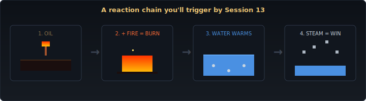

# Month 2 — The Chemistry

**Sessions 9–16 · Release: `sand-sim` v0.2**

  

Month 1 built an engine. Month 2 turns it into a chemistry set. By the end of these eight sessions the same sandbox will have fire that spreads, oil that ignites explosively, water that boils to steam, lava that cools to stone, ice that melts, and acid that eats almost everything.

The single most important session this month is **Session 14**, where you stop scattering reaction logic across `if` statements and start storing reactions in a lookup table. Once that lands, adding a new reaction is three lines of code — and you'll feel like you've built a *system* rather than a program.

---

## The arc

| Session | Concept introduced | What it adds to the sim |
|---|---|---|
| 9 | `struct`, `impl`, `&self` / `&mut self` methods | Cells now have a **temperature**, glowing warmer colours when hot. |
| 10 | `Option<T>`, enum variants with data | The first formal **reaction** rule: wood next to fire ignites. |
| 11 | `fastrand::f32()` for probabilities, cell lifetimes | **Fire spreads, burns out, raises adjacent temperature.** |
| 12 | `Vec` in depth, neighbour iteration | **Oil ignites explosively** — different burn behaviour to wood. |
| 13 | Iterators: `.iter()`, `.enumerate()`, `.map()`, `.filter()` | **Water boils to steam; steam rises and condenses back.** |
| 14 | `HashMap`, structured `ReactionOutcome` | **Acid** + the reactions architecture refactor (the big one). |
| 15 | (Project session — no new concept) | **Lava + Ice** added via the reactions table. Chain reactions. |
| 16 | (Project session — no new concept) | Reaction balancing, heat-map overlay, element counts, audio effects. **v0.2 ships.** |

---

## What you'll know by Session 16

- How to define structs and add methods with `impl` blocks
- How `Option<T>` replaces null pointers and forces you to handle the `None` case
- The basics of iterators — Rust's most-loved feature once you get used to them
- `HashMap` and when a lookup table beats a chain of `if`s
- The discipline of small refactors — the Session 14 reaction system rewrite is the most-used reasoning skill in working software
- A real sense for **emergent behaviour** — how simple per-cell rules produce complex visible patterns (convection cycles, explosion shapes, fire spreading along an oil trail)

---

## What you'll build

`sand-sim` v0.2 — same sandbox as v0.1, plus:

- **Six new elements:** wood, fire, oil, steam, lava, ice, acid
- **A reactions table** containing every interaction between every pair of elements, easily extended
- **Temperature** as a per-cell property, with a heat-map overlay toggle (`T`)
- **Convection** behaviour: heat a stone bowl of water from below, watch it boil
- **Chain reactions:** lava hitting water solidifies to stone while steam rises and condenses; ice next to fire melts to water that gets boiled by the fire
- **Audio:** fire crackle, lava sizzle, low explosion thump on oil ignition
- An on-screen element counter so you can see (e.g.) how much steam is currently in the world

The whole thing is the same Cargo project from Month 1, evolved: `month-2/milestone/sand-sim-v0.2/`. The session-by-session `starter/` and `solution/` folders work the same way.

---

## The Month 2 milestone

After Session 16, complete [`dfe/milestone-2-reflection.md`](../dfe/milestone-2-reflection.md). The reflection prompt asks you to compare what the program could do at v0.1 versus v0.2 — that's an easy and satisfying paragraph to write.

Tag the commit `v0.2` if you'd like.

---

## Chemistry primer

If you haven't already, skim [`CHEMISTRY-PRIMER.md`](../CHEMISTRY-PRIMER.md) before Session 9 — it covers combustion, phase change, and oxidation in plain English. You don't need to memorise any of it, but the reaction names will land harder if you know what they mean in real life.

---

## Crate budget for Month 2

No new external crates. `macroquad` and `fastrand` (and `std::collections::HashMap`, which is part of the standard library) carry the whole month.

The audio sources in Session 16 are CC0 WAV files added to the milestone project's `assets/` folder — attribution lives in [`month-2/milestone/sand-sim-v0.2/assets/CREDITS.md`](./milestone/sand-sim-v0.2/assets/CREDITS.md) when you ship the session.

---

## Ready?

→ [Session 9: Structs — Giving Cells a Temperature](./session-09/README.md)
