# Month 3 — The Alchemy Game

**Sessions 17–24 · Release: `sand-sim` v1.0**

  

The first two months built an engine and a chemistry set. Month 3 turns it into a **game**. By the end of these eight sessions the sandbox has a title screen, save and load, a discovery-based progression system where you start with four elements and earn the rest by experimentation, and a Pokédex-style codex that fills in as you unlock things. Plus a few easter eggs.

Session 17 is unusual: it has no new visible feature. Instead it splits the project across multiple files. By the end of it `main.rs` will be shorter than it was at the end of Session 1. That feels weird the first time it happens — and good. (Then you go play with explosions in Session 21.)

---

## The arc

| Session | Concept introduced | What it adds to the sim |
|---|---|---|
| 17 | `mod`, `pub`, `use`, multi-file projects | Codebase split into clean modules. `main.rs` shrinks from ~500 lines to ~25. |
| 18 | `serde`, `serde_json`, `Result<T, E>`, the `?` operator | **Save / load** — press `S`, close the app, reopen, press `L`. World restored. |
| 19 | Closures, iterators in depth, `Fn` trait | **Recipe system** — combining two elements can unlock a new one in the selector. |
| 20 | Generics, `Box<dyn Trait>` | The **codex UI** — discovered elements in colour, undiscovered ones as grey silhouettes. |
| 21 | `move` closures, iterator chaining | **Gunpowder** (explosions) and **glass** (made from very hot sand). |
| 22 | `std::time`, time-based state changes | **Concrete** sets over time; **metal** rusts in contact with water (yes, the joke is intentional). |
| 23 | `enum GameState`, state-machine pattern | Title screen, three hidden recipes, an easter egg. |
| 24 | (Project session — final polish + retrospective) | README, clippy pass, "what you've built" summary. **v1.0 ships.** |

---

## What you'll know by Session 24

- How to split a Rust project across multiple files using `mod` and `pub`
- File I/O with `std::fs`, and serialisation/deserialisation with `serde` and `serde_json`
- `Result<T, E>` and the `?` operator for ergonomic error handling
- Closures — both `Fn` (borrow) and `move` (own) — and how iterators use them
- Generics: writing functions and types that work for many types at once
- `Box<dyn Trait>` for dynamic dispatch when generics are too restrictive
- The state-machine pattern for managing UI screens (title vs game vs codex)
- A taste for **what to refactor and when** — Session 17's module split is the most generally-applicable engineering lesson in the course

---

## What you'll build

`sand-sim` v1.0 — same engine and chemistry as v0.2, now wrapped in a game:

- **Title screen** with the game's name and a prompt to start
- **Save / load** to a human-readable JSON file (you can open the save in VS Code and see the grid)
- **Discovery system:** the element selector starts with four elements unlocked. The rest are locked behind reactions that the player has to stumble into.
- **The codex** (`TAB` to open): a Pokédex-style grid showing every element. Discovered ones appear in colour with their name. Undiscovered ones show as grey silhouettes with "???".
- **Six new elements** revealed through recipes: glass, gunpowder, mud, concrete, rust, wet sand
- **Three hidden recipes** that aren't hinted at anywhere — pure discovery
- **An easter egg** triggered by a specific key combination
- A `README.md` for the project that someone with no programming experience could read

The whole thing lives in `month-3/milestone/sand-sim-v1.0/`, which starts as a copy of `sand-sim-v0.2` (with the module split applied in Session 17).

---

## The Month 3 milestone

After Session 24, complete [`dfe/milestone-3-reflection.md`](../dfe/milestone-3-reflection.md) and write your participant statement in [`dfe/participant-statement-template.md`](../dfe/participant-statement-template.md). Then hand the repo to your assessor — they have a briefing in [`dfe/assessor-briefing.md`](../dfe/assessor-briefing.md) that explains what to look for.

Tag the final commit `v1.0`. Push it to GitHub. You've shipped.

---

## Crate budget for Month 3

Two new crates, both standard issue:

- **`serde`** (`1.x`) with the `derive` feature — Rust's serialisation framework. Added in Session 18.
- **`serde_json`** (`1.x`) — JSON support for serde. Added in Session 18.

The combo is by far the most-used pair of crates in the Rust ecosystem. Worth knowing.

---

## What comes after the course

Session 24 ends with a short "what next" section pointing at:

- **Multi-threading** the simulation with `rayon` — make it faster
- **Chunked worlds** — make the world effectively infinite
- **WebAssembly** — compile the whole thing to run in a browser
- **The Bevy game engine** — go further with games, especially 3D
- **Real fluid dynamics** — Navier-Stokes equations, reaction-diffusion systems
- **Embedded Rust** — running Rust on a microcontroller

None of those are required. They're directions, if you want them.

---

## Ready?

→ [Session 17: Modules — Taming the Codebase](./session-17/README.md)
